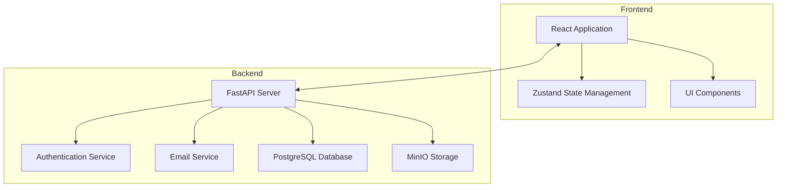
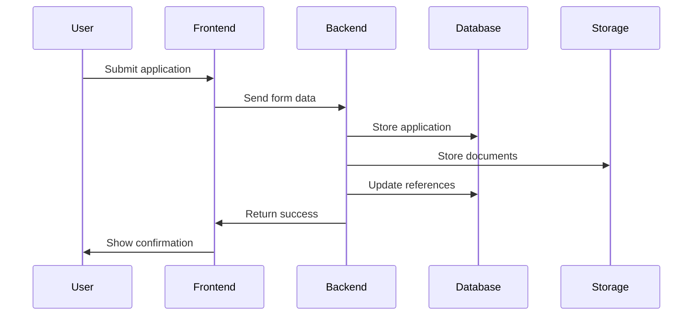

# Finance Onboarding Application Architecture

## System Overview

The Finance Onboarding Application is a full-stack web application built with React (frontend) and FastAPI (backend). It facilitates the onboarding process for financial applications with a focus on security, user experience, and efficient admin workflows.



## Key Components

### Frontend Architecture

1. **State Management**
   - Uses Zustand for global state
   - Manages authentication state
   - Handles application form data
   - Manages admin dashboard state

2. **Key Components**
   ```mermaid
   graph TD
       App[App]
       Auth[AuthPage]
       Dashboard[Dashboard]
       Admin[AdminDashboard]
       Forms[Application Forms]
       
       App --> Auth
       App --> Dashboard
       App --> Admin
       Dashboard --> Forms
   ```

3. **Authentication Flow**
   ```mermaid
   sequenceDiagram
       participant User
       participant AuthPage
       participant Backend
       participant AdminDashboard
       
       User->>AuthPage: Click email link
       AuthPage->>Backend: Logout (clear cookies)
       Backend->>AuthPage: Redirect with params
       User->>AuthPage: Login
       AuthPage->>Backend: Authenticate
       Backend->>AuthPage: Return token
       AuthPage->>AdminDashboard: Navigate with params
       AdminDashboard->>Backend: Load application
   ```

### Backend Architecture

1. **API Structure**
   - Authentication endpoints
   - Application management
   - Document handling
   - Admin operations

2. **Services**
   ```mermaid
   graph LR
       API[API Layer]
       Auth[Auth Service]
       Email[Email Service]
       Storage[Storage Service]
       DB[Database Service]
       
       API --> Auth
       API --> Email
       API --> Storage
       API --> DB
   ```

## Security Features

1. JWT-based authentication
2. Secure cookie handling
3. Role-based access control
4. Secure file storage with MinIO

## Data Flow



## Admin Dashboard Features

1. Application viewing and management
2. Risk assessment integration
3. Document verification
4. Status updates
