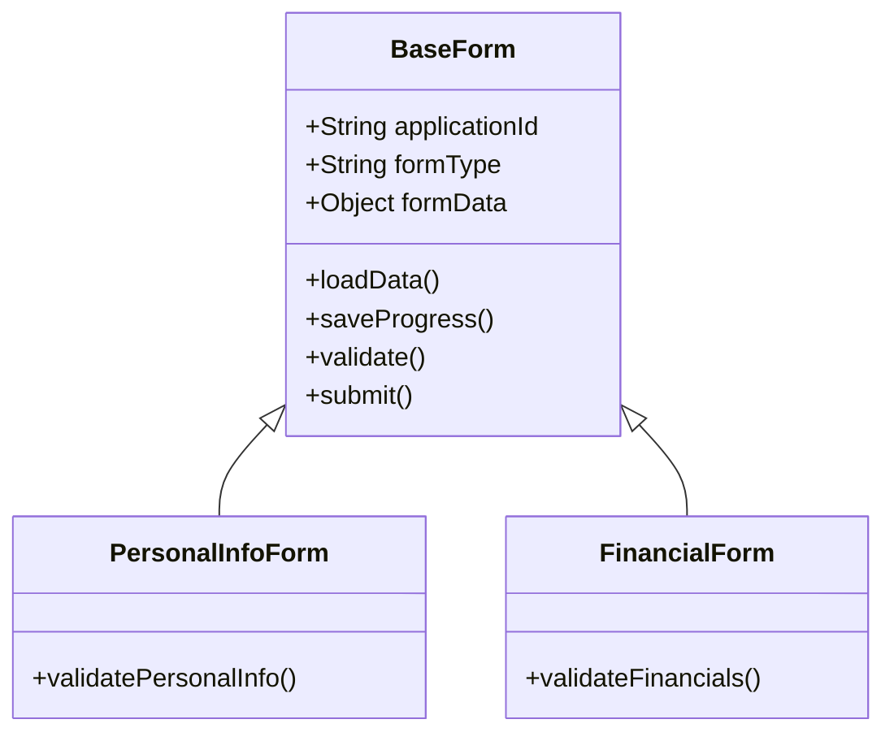
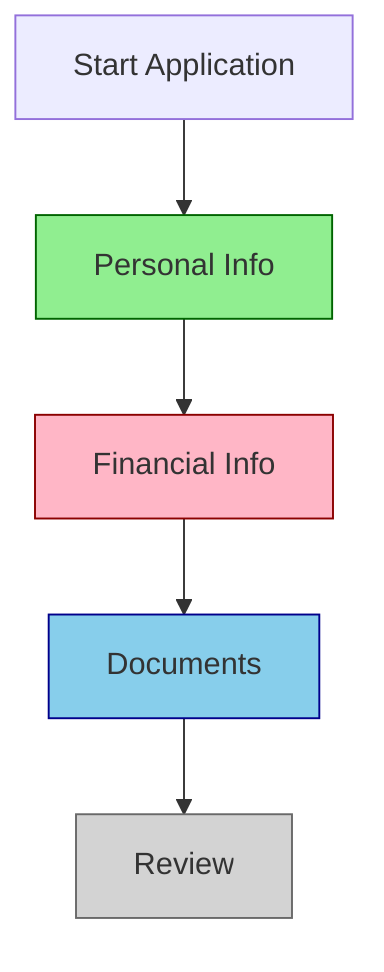

# Form Management System

## Overview

This document details the standardized form management system implemented across the application, focusing on consistent data handling and progress tracking.

## Form Data Management

### 1. Data Loading Utility

```javascript
// utils/formData.js
export const loadFormData = async (applicationId, formType) => {
  try {
    const response = await fetch(`/api/applications/${applicationId}/forms/${formType}`);
    if (!response.ok) throw new Error('Failed to load form data');
    const data = await response.json();
    
    // Store in localStorage as backup
    localStorage.setItem(`form_${applicationId}_${formType}`, JSON.stringify({
      data,
      timestamp: Date.now()
    }));
    
    return data;
  } catch (error) {
    // Try to load from localStorage
    const cached = localStorage.getItem(`form_${applicationId}_${formType}`);
    if (cached) {
      const { data, timestamp } = JSON.parse(cached);
      if (Date.now() - timestamp < 24 * 60 * 60 * 1000) { // 24 hours
        return data;
      }
    }
    throw error;
  }
};
```

### 2. Progress Saving Utility

```javascript
// utils/formProgress.js
export const saveFormProgress = async (applicationId, formType, data) => {
  try {
    // Save to backend
    const response = await fetch(`/api/applications/${applicationId}/forms/${formType}`, {
      method: 'POST',
      headers: { 'Content-Type': 'application/json' },
      body: JSON.stringify(data)
    });
    
    if (!response.ok) throw new Error('Failed to save form data');
    
    // Update localStorage
    localStorage.setItem(`form_${applicationId}_${formType}`, JSON.stringify({
      data,
      timestamp: Date.now()
    }));
    
    return true;
  } catch (error) {
    console.error('Error saving form:', error);
    return false;
  }
};
```

## Form Components

### 1. Base Form Structure



### 2. Form Implementation

```javascript
// components/BaseForm.jsx
const BaseForm = ({ applicationId, formType, children }) => {
  const [data, setData] = useState(null);
  const [saving, setSaving] = useState(false);
  
  useEffect(() => {
    loadFormData(applicationId, formType)
      .then(setData)
      .catch(console.error);
  }, [applicationId, formType]);
  
  const handleSave = async () => {
    setSaving(true);
    try {
      await saveFormProgress(applicationId, formType, data);
      toast.success('Progress saved successfully');
    } catch (error) {
      toast.error('Failed to save progress');
    } finally {
      setSaving(false);
    }
  };
  
  return (
    <div className="form-container">
      {children(data, setData)}
      <Button 
        onClick={handleSave}
        disabled={saving}
      >
        {saving ? 'Saving...' : 'Save Progress'}
      </Button>
    </div>
  );
};
```

## Progress Tracking

### 1. Progress Data Structure

```typescript
interface FormProgress {
  applicationId: string;
  formType: string;
  data: any;
  lastSaved: Date;
  isComplete: boolean;
  validationErrors: string[];
}

interface ApplicationProgress {
  id: string;
  forms: {
    [formType: string]: FormProgress;
  };
  overallProgress: number;
  lastUpdated: Date;
}
```

### 2. Progress Visualization



## Form Validation

### 1. Validation Rules

```javascript
// utils/validation.js
export const validateForm = (formType, data) => {
  const errors = [];
  
  switch (formType) {
    case 'personal':
      if (!data.name) errors.push('Name is required');
      if (!isValidEmail(data.email)) errors.push('Invalid email');
      break;
      
    case 'financial':
      if (!data.income) errors.push('Income is required');
      if (data.income < 0) errors.push('Income must be positive');
      break;
      
    // Add more form types
  }
  
  return errors;
};
```

### 2. Auto-Save Implementation

```javascript
// hooks/useAutoSave.js
export const useAutoSave = (applicationId, formType, data) => {
  useEffect(() => {
    const timer = setTimeout(() => {
      if (data) {
        saveFormProgress(applicationId, formType, data)
          .then(success => {
            if (success) console.log('Auto-saved form data');
          })
          .catch(console.error);
      }
    }, 30000); // Auto-save every 30 seconds
    
    return () => clearTimeout(timer);
  }, [applicationId, formType, data]);
};
```

## Error Handling

### 1. Network Errors

```javascript
const handleSaveError = async (error) => {
  console.error('Save error:', error);
  
  // Store in localStorage
  localStorage.setItem(`form_${applicationId}_${formType}_pending`, JSON.stringify({
    data,
    timestamp: Date.now()
  }));
  
  // Show error message
  toast.error('Failed to save. Changes stored locally.');
  
  // Schedule retry
  setTimeout(retryPendingSaves, 5000);
};
```

### 2. Data Recovery

```javascript
const recoverFormData = async (applicationId, formType) => {
  // Check localStorage for pending saves
  const pending = localStorage.getItem(`form_${applicationId}_${formType}_pending`);
  if (pending) {
    const { data, timestamp } = JSON.parse(pending);
    
    // Attempt to save pending data
    try {
      await saveFormProgress(applicationId, formType, data);
      localStorage.removeItem(`form_${applicationId}_${formType}_pending`);
      return data;
    } catch (error) {
      console.error('Recovery failed:', error);
    }
  }
  
  // Fall back to last known good state
  return loadFormData(applicationId, formType);
};
```

## Testing Strategy

### 1. Unit Tests

```javascript
describe('Form Management', () => {
  it('saves form progress', async () => {
    const result = await saveFormProgress('123', 'personal', testData);
    expect(result).toBe(true);
  });
  
  it('loads form data with fallback', async () => {
    // Mock failed API call
    fetchMock.mockRejectOnce();
    
    // Set localStorage backup
    localStorage.setItem('form_123_personal', JSON.stringify({
      data: testData,
      timestamp: Date.now()
    }));
    
    const data = await loadFormData('123', 'personal');
    expect(data).toEqual(testData);
  });
});
```

### 2. Integration Tests

```javascript
describe('Form Workflow', () => {
  it('handles complete form submission', async () => {
    // Fill form
    await fillFormFields(testData);
    
    // Save progress
    await clickSave();
    expect(await getProgressPercentage()).toBe(100);
    
    // Submit form
    await clickSubmit();
    expect(await getSubmissionStatus()).toBe('completed');
  });
});
```
