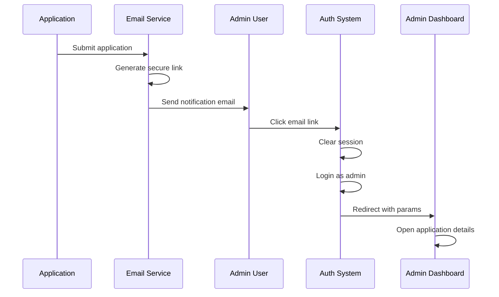
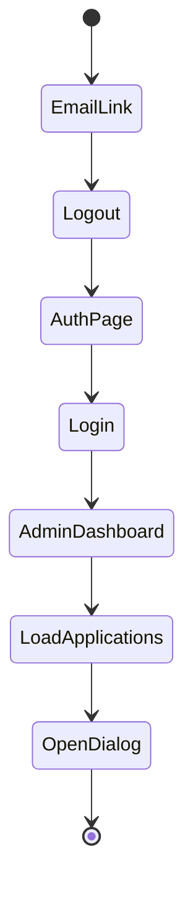

# Technical Specification: Admin Dashboard Navigation

## Overview

This document details the implementation of the admin dashboard navigation system, focusing on the automatic redirection to specific application details after admin login.

## Implementation Details

### 1. Email Notification System



#### URL Structure
1. Initial Email Link:
```
${BACKEND_URL}/api/logout?redirect=${encodeURIComponent(loginPath)}
```

2. Login Page Redirect:
```
${FRONTEND_URL}/auth?redirect=${encodeURIComponent(adminPath)}
```

3. Final Dashboard URL:
```
${FRONTEND_URL}/admin/dashboard?application=${applicationId}&view=details
```

### 2. Authentication Flow

#### Backend (FastAPI)
```python
@app.get("/api/logout")
async def logout(redirect: str = None):
    redirect_url = redirect if redirect.startswith("http") else f"{frontend_url}/auth"
    if "?" in redirect_url:
        redirect_url += "&clearState=true"
    else:
        redirect_url += "?clearState=true"
    response = RedirectResponse(url=redirect_url)
    response.delete_cookie(key="access_token")
    return response
```

#### Frontend (React)
```javascript
// AuthPage.jsx
const handleLoginSubmit = async (e) => {
  e.preventDefault();
  const data = await LoginUser(email, password);
  login({ user, token: access_token, role });
  
  // Handle redirect with URL parameters
  const redirect = decodeURIComponent(params.get('redirect'));
  if (role === "admin" && redirect) {
    navigate(redirect, { replace: true });
  }
};

// AdminDashboard.jsx
useEffect(() => {
  const params = new URLSearchParams(window.location.search);
  const applicationId = params.get('application');
  const view = params.get('view');
  
  if (applicationId && view === 'details' && applications.length > 0) {
    const app = applications.find(a => a.id === applicationId);
    if (app) {
      loadApplicationDetails(applicationId);
    }
  }
}, [searchParams, applications]);
```

### 3. State Management

#### Zustand Store
```javascript
const useAuthStore = create((set) => ({
  user: null,
  role: null,
  token: null,
  login: (data) => set(data),
  logout: () => set({ user: null, role: null, token: null })
}));
```

### 4. Component Lifecycle



## Security Considerations

1. **URL Parameters**
   - All redirect URLs are encoded to prevent injection
   - Parameters are validated before use
   - Full URLs are parsed to extract safe paths

2. **Session Management**
   - Cookies are cleared on logout
   - New session is created on login
   - Token validation on protected routes

3. **Access Control**
   - Role verification before loading application details
   - Secure parameter handling
   - Protected API endpoints

## Error Handling

1. **URL Processing**
```javascript
try {
  redirect = decodeURIComponent(redirect);
  if (redirect.startsWith('http')) {
    const url = new URL(redirect);
    redirect = url.pathname + url.search;
  }
} catch (e) {
  console.error('Error processing redirect URL:', e);
  // Fall back to default dashboard
}
```

2. **Application Loading**
```javascript
try {
  const app = applications.find(a => a.id === applicationId);
  if (app) {
    await loadApplicationDetails(applicationId);
  } else {
    console.warn('Application not found:', applicationId);
  }
} catch (err) {
  console.error('Error loading application:', err);
  setError(err.message);
}
```

## Testing Strategy

1. **Unit Tests**
   - URL parameter handling
   - Redirect processing
   - State management

2. **Integration Tests**
   - Email link generation
   - Authentication flow
   - Navigation chain

3. **E2E Tests**
   - Complete workflow from email to application details
   - Error scenarios
   - Edge cases

## Performance Considerations

1. **State Updates**
   - Efficient application data loading
   - Minimized re-renders
   - Optimized dialog opening

2. **URL Handling**
   - Proper encoding/decoding
   - Safe parameter extraction
   - Error recovery

## Monitoring and Logging

1. **Console Logging**
```javascript
console.log('URL Parameters:', window.location.search);
console.log('Parsed - application:', applicationId, 'view:', view);
console.log('Current applications:', applications);
```

2. **Error Tracking**
```javascript
console.error('Error viewing details:', err);
setError(err.message);
```

## Future Improvements

1. **Enhanced Security**
   - Additional parameter validation
   - Stricter URL parsing
   - More robust error handling

2. **User Experience**
   - Loading indicators
   - Error messages
   - Fallback behaviors

3. **Performance**
   - Caching strategies
   - Optimized data loading
   - Reduced network requests
